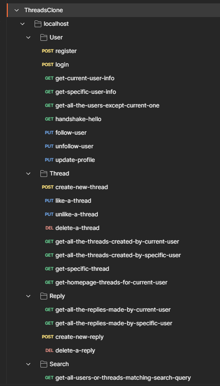

# Threads Clone

## Hosted Link
[Threads Clone](https://threads-clone-weld-ten.vercel.app/)

## About Threads
+ [Threads](https://threads.net/) is an online social media and social networking service operated by [Meta Platforms](https://en.wikipedia.org/wiki/Meta_Platforms).
+ Functionality is similar to Twitter, users can post text, images, and videos, as well as interact with other users' posts through replies, reposts, and likes.

## Features
### User Management
+ **User Registration**: Enable users to create new accounts.
+ **User Login**: Allow users to securely log in.
+ **Follow/Unfollow Users**: Users can follow or unfollow other users.
+ **Profile Management**: Users can update their profile information including bio, links, and profile image.

### Threads
+ **Create Threads**: Users can create new threads with text and images.
+ **Like/Unlike Threads**: Users can like or unlike threads.
+ **Delete Threads**: Users can delete their own threads.
+ **View Threads**: Users can view all threads created by themselves and others.
  
### Replies
+ **Create Replies**: Users can reply to threads.
+ **Delete Replies**: Users can delete their own replies.

### Theming
+ **Dark/Light Theme**: Users can switch between dark and light themes.

    

## Tech. Stack Used:
### Front End
+ [ReactJS](https://react.dev/)
+ [ReduxToolkit](https://redux-toolkit.js.org/) for global state management 
+ [React Router Dom](https://reactrouter.com/en/main/start/tutorial) for providing routing functionality
+ [Material UI](https://mui.com/material-ui/getting-started/)
+ [TailwindCSS](https://tailwindcss.com/)
+ [Google Fonts](https://fonts.google.com/)
+ [Font Awesome Icons](https://fontawesome.com/icons/)

## Back End
+ [MVC Framework](https://en.wikipedia.org/wiki/Model%E2%80%93view%E2%80%93controller)
+ [ExpressJS](https://expressjs.com/) for Server Setup
+ [NodeJS](https://nodejs.org/en)
+ [MongoDB](https://www.mongodb.com) for Database
+ [JWT](https://jwt.io/) for JSON tokens
+ [Passport](https://www.passportjs.org/) for JWT Authentication
+ [Cloudinary](https://cloudinary.com/) for storing Media (images)
+ [Morgan](https://www.npmjs.com/package/morgan) for logging user requests
+ [Multer](https://www.npmjs.com/package/multer) for files upload
+ [Validator](https://www.npmjs.com/package/validator) for input validation


## How to install and run in yours local machine
```bash
npm install
npm start
```

## .env Files
### Front End
```javascript
REACT_APP_HIDE_SNACKBAR_AFTER_N_MILLISECONDS=4000
REACT_APP_PREFIX_LOCALSTORAGE=alex21cThreadsClone-
REACT_APP_SERVER_BASE_URL_LOCALHOST=http://localhost:4000
REACT_APP_SERVER_BASE_URL_RENDER=https://threadsclone-m3i6.onrender.com
REACT_APP_SERVER_BASE_URL=http://localhost:4000
REACT_APP_PRJ_NAME="Threads Clone"
REACT_APP_DEFAULT_USER_PROFILE_IMAGE_URL=https://res.cloudinary.com/dwlfgbmsi/image/upload/v1718603004/SharedResources/a7syt68cd0kyj3tiyhux.png
REACT_APP_MAX_ALLOWED_PROFILE_IMAGE_SIZE_IN_KB=500
```

### Back End
```javascript
PORT=4000
JWT_PRIVATE_KEY=ThreadsClone-PrivateKeyCreatedOn17JuneByAlex21C$
MONGODB_CONNECTION_STRING_LOCALHOST=mongodb://localhost:27017/ThreadsClone
MONGODB_CONNECTION_STRING_ATLAS=mlcToDo-get-yours-from-mongodb
USER_SESSION_EXPIRES_AFTER="1d"
CLOUDINARY_CLOUD_NAME=mlcToDo-get-yours-from-cloudinary
CLOUDINARY_API_KEY=mlcToDo-get-yours-from-cloudinary
CLOUDINARY_API_SECRET=mlcToDo-get-yours-from-cloudinary
MAX_ALLOWED_FILE_UPLOAD_SIZE_IN_KB=500
PRJ_NAME=ThreadsClone
ByDefaultHowManyUsersToFetchForSearchPage=100
DEFAULT_USER_PROFILE_IMAGE_URL=https://res.cloudinary.com/dwlfgbmsi/image/upload/v1718603004/SharedResources/a7syt68cd0kyj3tiyhux.png
```
### Reference:
+ [Get Yours MONGODB_CONNECTION_STRING_ATLAS](https://www.mongodb.com/)
+ [Get Yours Cloudinary API_KEYS](https://cloudinary.com/)
  
### examples of valid expiry timestamps
```javascript
'2 days'  // 172800000
'1d'      // 86400000
'10h'     // 36000000
'2.5 hrs' // 9000000
'2h'      // 7200000
'1m'      // 60000
'5s'      // 5000
'1y'      // 31557600000
```


## Credits
i express my gratitude towards [Geekster](https://www.geekster.in/) for providing me opportunity to become MERN Stack developer and achieve my vision board Financial Freedom Goal! Apart from Geekster i express my gratitude towards:
+ [Divyansh Moonat](https://www.linkedin.com/in/divyanshmoonat/) Sir (Educator NodeJS/ExpressJS/MongoDB)
+ [Ankit Singh](https://www.linkedin.com/in/asingh88029/) Sir (Educator Assistant)
+ Manan Bansal Sir (For checking Assignments, projects and providing feedback)
+ Success Managers: Palak Bhardwaj Mam, Yatharth Sharma Sir, Aanchal Parnami Mam, Avinash Prakash Sir
+ Geekster Curriculum Team: for designing cutting edge ReactJs Curriculum along with real life industry standard assignments as projects
+ Geekster Administrative Team: for timely starting classes, providing concept videos and study material!


## API Endpoints

### Download Postman endpoints file 
+ [postman-api-endpoints.json](ThreadsClone.postman_collection.json)
### Server Base URL 
```javascript
LOCALHOST=http://localhost:4000
RENDER=https://threadsclone-m3i6.onrender.com
```

## 1. User Endpoints
### 1.1 POST /api/v1/user/register
### Purpose:
Create new User Account.
### Request Body:
```javascript
JSON BODY
{
"firstName" : "abhishek",
"lastName" : "kumar", 
"email" : "abhishek@alex21c.com", 
"mobile" : "01234567893", 
"username" : "admin", 
"password" : "admin123", 
"bio" : "MERN Stack Developer", 
"customLink" : "https://www.alex21c.com"
}

```
### Response Success:
```javascript
JSON
{
    "success": true,
    "Authorization": "Bearer JWT_TOKEN"
}
```
### Response failure:
```javascript
JSON
{
    "success": false,
    "message": "username already exist!"
}
```
### 1.2 POST /api/v1/user/login
### Purpose:
Authentication, Sign-In user
### Request Body:
```javascript
JSON BODY
{
 "usernameOrEmailOrMobile": "admin",
 "password": "admin123"
}

```
### Response Success:
```javascript
JSON
{
    "success": true,
    "Authorization": "Bearer JWT_TOKEN"
}
```

### 1.3 GET /api/v1/user/get-current-user-info
### Purpose:
Get current user document from database, after excluding password, Useful for fetching what users follows, likes, profileImage and name etc.
### Request Body:
```javascript
HEADERS
Authorization = Bearer JWT_TOKEN
```
### Response Success:
```javascript
JSON
{
    "success": true,
    "data": {
        "_id": "6676652aaa7e004433c0da79",
        "firstName": "abhishek",
        "lastName": "kumar",
        "email": "abhishek@alex21c.com",
        "mobile": "01234567893",
        "username": "admin",
        "bio": "MERN Stack Developer",
        "profileImage": {
            "public_id": null,
            "url": "https://res.cloudinary.com/dwlfgbmsi/image/upload/v1718603004/SharedResources/a7syt68cd0kyj3tiyhux.png"
        },
        "customLink": "https://www.alex21c.com",
        "followers": [],
        "following": [],
        "likedThreads": [],
        "createdAt": "2024-06-22T05:46:18.595Z",
        "updatedAt": "2024-06-22T05:46:18.595Z",
        "__v": 0
    }
}
```

### 1.4 GET /api/v1/user/get-specific-user-info/:username
### Purpose:
Get the specific user info, everything except the password
### Example Request
```javascript
GET api/v1/user/get-specific-user-info/popeye
```
### Request Body:
```javascript
HEADERS
Authorization = Bearer JWT_TOKEN
```
### Response Success:
```javascript
JSON
{
    "success": true,
    "data": {
        "_id": "667937501a89c30b67dda3b4",
        "firstName": "pop",
        "lastName": "eye",
        "username": "popeye",
        "profileImage": {
            "public_id": "ThreadsClone/popeye-profileImage/potatoes-Wwcm3DnTn5qHXeaSFhnP0",
            "url": "https://res.cloudinary.com/dwlfgbmsi/image/upload/v1720173217/ThreadsClone/popeye-profileImage/potatoes-Wwcm3DnTn5qHXeaSFhnP0.jpg"
        },
        "followers": [
            "667936c01a89c30b67dda396",
            "6685196ffe80aed1e4fc7e81"
        ],
        "following": [
            "667936c01a89c30b67dda396"
        ],
        "likedThreads": [
            "66793808f91b071aa3b6916f",
            "6679435fe37d2d6a3a4b7f37",
        ],
        "createdAt": "2024-06-24T09:07:28.647Z",
        "updatedAt": "2024-07-08T05:17:03.077Z",
        "__v": 449,
        "bio": "new bio2933",
        "customLink": "http://www.abc.com"
    }
}
```

### 1.5 GET /api/v1/user/get-all-the-users-except-current-one?howManyUsers=100
### Purpose:
Get all the users info, except current user, useful when current user is searching for users on search page
### Note
`howManyUsers` here default value is 100, that means by default 100 users will be fetched !
### Request Headers:
```javascript
HEADERS
Authorization = Bearer JWT_TOKEN
```
### Response Success:
```javascript
JSON
{
    "success": true,
    "data": [
        {
            "_id": "667937501a89c30b67dda3b4",
            "firstName": "pop",
            "lastName": "eye",
            "email": "pop@eye.com",
            "mobile": "1123456789",
            "username": "popeye",
            "password": "$2b$10$FTncp5EPFQ37Eap.dJ.syek7xSYluUwDwZa68ujLUctsE.ti6Tb0m",
            "profileImage": {
                "public_id": "ThreadsClone/popeye-profileImage/potatoes-Wwcm3DnTn5qHXeaSFhnP0",
                "url": "https://res.cloudinary.com/dwlfgbmsi/image/upload/v1720173217/ThreadsClone/popeye-profileImage/potatoes-Wwcm3DnTn5qHXeaSFhnP0.jpg"
            },
            "followers": [
                "667936c01a89c30b67dda396",
                "6685196ffe80aed1e4fc7e81"
            ],
            "following": [
                "667936c01a89c30b67dda396"
            ],
            "likedThreads": [
                "66793808f91b071aa3b6916f",
                "6679435fe37d2d6a3a4b7f37",
                "66851bcd780bc05289c29905"
            ],
            "createdAt": "2024-06-24T09:07:28.647Z",
            "updatedAt": "2024-07-08T05:17:03.077Z",
            "__v": 449,
            "bio": "new bio2933",
            "customLink": "http://www.abc.com"
        },
        {
            "_id": "6685196ffe80aed1e4fc7e81",
            "firstName": "nature",
            "lastName": "",
            "email": "nature@alex21c.com",
            "mobile": "9999999999",
            "username": "nature",
            "password": "$2b$10$4PfeEjIE9/uRn5kZM2VExOYhBJwOZCxwgPp.Fa6UfXwVczk1PEuRi",
            "bio": "",
            "profileImage": {
                "public_id": null,
                "url": "https://res.cloudinary.com/dwlfgbmsi/image/upload/v1718603004/SharedResources/a7syt68cd0kyj3tiyhux.png"
            },
            "customLink": "",
            "followers": [
                "66867ab5b760fcdceb536abe",
                "667936c01a89c30b67dda396"
            ],
            "following": [
                "667937501a89c30b67dda3b4",
                "667d41d4f302c7b316689987",
                "667936c01a89c30b67dda396",
                "6687d29878a34a0f0b6c63d3"
            ],
            "likedThreads": [
                "66851ba8780bc05289c298c8",
                "66851bcd780bc05289c29905"
            ],
            "createdAt": "2024-07-03T09:27:11.766Z",
            "updatedAt": "2024-07-05T10:46:09.728Z",
            "__v": 30
        }
    ]
}
```

### 1.6 GET /api/v1/user/handshake-hello
### Purpose:
render server free edition, by default goes into inactive phase if there is no activity, this request is to make that server active once again !

### Response Success:
```javascript
JSON
{
    "success": true,
    "message": "hi there!"
}
```

### 1.7 PUT /api/v1/user/follow-user
### Purpose:
follow another user
### Request Headers:
```javascript
HEADERS
Authorization = Bearer JWT_TOKEN
```
### Request Body
```javascript
JSON
{
 "userID" :  "667936c01a89c30b67dda396"
}
```
### Response Success:
```javascript
JSON
{
    "success": true,
    "message": "alex21c followed successfully !"
}
```

### 1.7 PUT /api/v1/user/unfollow-user
### Purpose:
unfollow previously followed  user
### Request Headers:
```javascript
HEADERS
Authorization = Bearer JWT_TOKEN
```
### Request Body
```javascript
JSON
{
 "userID" :  "667936c01a89c30b67dda396"
}
```
### Response Success:
```javascript
JSON
{
    "success": true,
    "message": "alex21c unfollowed successfully !"
}
```

### 1.8 PUT /api/v1/user/update-profile
### Purpose:
unfollow previously followed  user
### Request Headers:
```javascript
HEADERS
Authorization = Bearer JWT_TOKEN
```
### Request Body
```javascript
FORM-DATA
bodyImage: File | imageFile
userBioUpdated: text | user new bio
userCustomLinkUpdated : text | user new custom href link
```
### Response Success:
```javascript
JSON
{
    "success": true,
    "message": "alex21c Profile udpated successfully !"
}
```


## 2. Thread Endpoints
### 2.1 POST /api/v1/thread/create-new-thread
### Purpose:
Create a new Thread
### Request Body:
Either bodyText or BodyImage is required, or can provide both !
```javascript
HEADERS
Authorization = Bearer JWT_TOKEN

FORM-DATA
bodyImage : Image File
bodyText : my very first thread !
```
### Response Success:
```javascript
JSON
{
    "success": true,
    "message": "Thread Created Successfully !",
    "threadID": "6676685caa7e004433c0da7f"
}
```
### 2.2 PUT /api/v1/thread/like-a-thread
### Purpose:
Like a Thread
### Request Body:
```javascript
HEADERS
Authorization = Bearer JWT_TOKEN

JSON BODY
{
 "threadID" :  "6676685caa7e004433c0da7f"
}
```
### Response Success:
```javascript
JSON
{
    "success": true,
    "message": "Liked Successfully !",
    "totalLikes": 1
}
```
### 2.3 PUT /api/v1/thread/unlike-a-thread
### Purpose:
Unlike a Thread
### Request Body:
```javascript
HEADERS
Authorization = Bearer JWT_TOKEN

JSON BODY
{
 "threadID" :  "6676685caa7e004433c0da7f"
}
```
### Response Success:
```javascript
JSON
{
    "success": true,
    "message": "Un-Liked Successfully !",
    "totalLikes": 0
}
```
### 2.4 PUT /api/v1/thread/delete-a-thread
### Purpose:
Delete a Thread, iff created by current user
### Request Body:
```javascript
HEADERS
Authorization = Bearer JWT_TOKEN

JSON BODY
{
 "threadID" :  "6676699aaa7e004433c0da93"
}
```
### Response Success:
```javascript
JSON
{
    "success": true,
    "message": "Thread Deleted Successfully !"
}
```
### 2.5 GET /api/v1/thread/get-all-the-threads-created-by-current-user
### Purpose:
Get all the threads created by current user
### Request Headers:
```javascript
HEADERS
Authorization = Bearer JWT_TOKEN
```
### Response Success:
```javascript
JSON
{
    "success": true,
    "data": [
        {
            "_id": "6684f37050e7c6aadcdff8e6",
            "bodyText": "talking about the gold !",
            "createdBy": {
                "_id": "667936c01a89c30b67dda396",
                "username": "alex21c",
                "profileImage": {
                    "public_id": null,
                    "url": "https://res.cloudinary.com/dwlfgbmsi/image/upload/v1718986666/SharedResources/Star_qudgtj.png"
                }
            },
            "likes": [
                "667937501a89c30b67dda3b4"
            ],
            "replies": [
                {
                    "_id": "6687c1f6e22735f01cdec95d",
                    "bodyText": "asfd",
                    "bodyImage": null,
                    "createdBy": {
                        "_id": "667937501a89c30b67dda3b4",
                        "username": "popeye",
                        "profileImage": {
                            "public_id": "ThreadsClone/popeye-profileImage/potatoes-Wwcm3DnTn5qHXeaSFhnP0",
                            "url": "https://res.cloudinary.com/dwlfgbmsi/image/upload/v1720173217/ThreadsClone/popeye-profileImage/potatoes-Wwcm3DnTn5qHXeaSFhnP0.jpg"
                        }
                    },
                    "likes": [],
                    "replies": [],
                    "replyBelongsToThisThreadID": "6684f37050e7c6aadcdff8e6",
                    "replyBelongsToThreadCreatedByThisUser": "667936c01a89c30b67dda396",
                    "createdAt": "2024-07-05T09:50:46.316Z",
                    "updatedAt": "2024-07-05T09:50:46.316Z",
                    "__v": 0
                }
            ],
            "replyBelongsToThisThreadID": null,
            "replyBelongsToThreadCreatedByThisUser": null,
            "createdAt": "2024-07-03T06:45:04.292Z",
            "updatedAt": "2024-07-05T09:50:46.317Z",
            "__v": 25
        },
        {
            "_id": "667bb9f749cf5e4ccbcf57ee",
            "bodyText": "new post by popeye\r\n",
            "createdBy": {
                "_id": "667936c01a89c30b67dda396",
                "username": "alex21c",
                "profileImage": {
                    "public_id": null,
                    "url": "https://res.cloudinary.com/dwlfgbmsi/image/upload/v1718986666/SharedResources/Star_qudgtj.png"
                }
            },
            "likes": [
                "667936c01a89c30b67dda396",
                "667937501a89c30b67dda3b4"
            ],
            "replies": [],
            "replyBelongsToThisThreadID": null,
            "replyBelongsToThreadCreatedByThisUser": null,
            "createdAt": "2024-06-26T06:49:27.554Z",
            "updatedAt": "2024-07-04T06:06:31.929Z",
            "__v": 40
        },
        {
            "_id": "66794f00d1c3d954406a1d72",
            "bodyText": "",
            "createdBy": {
                "_id": "667936c01a89c30b67dda396",
                "username": "alex21c",
                "profileImage": {
                    "public_id": null,
                    "url": "https://res.cloudinary.com/dwlfgbmsi/image/upload/v1718986666/SharedResources/Star_qudgtj.png"
                }
            },
            "likes": [
                "667936c01a89c30b67dda396",
                "667937501a89c30b67dda3b4"
            ],
            "replies": [
                {
                    "_id": "66851bcd780bc05289c29905",
                    "bodyText": "its me nature",
                    "bodyImage": null,
                    "createdBy": {
                        "_id": "6685196ffe80aed1e4fc7e81",
                        "username": "nature",
                        "profileImage": {
                            "public_id": null,
                            "url": "https://res.cloudinary.com/dwlfgbmsi/image/upload/v1718603004/SharedResources/a7syt68cd0kyj3tiyhux.png"
                        }
                    },
                    "likes": [
                        "6685196ffe80aed1e4fc7e81",
                        "667937501a89c30b67dda3b4"
                    ],
                    "replies": [],
                    "replyBelongsToThisThreadID": "66794f00d1c3d954406a1d72",
                    "replyBelongsToThreadCreatedByThisUser": "667936c01a89c30b67dda396",
                    "createdAt": "2024-07-03T09:37:17.967Z",
                    "updatedAt": "2024-07-04T09:13:26.479Z",
                    "__v": 4
                }
            ],
            "replyBelongsToThisThreadID": null,
            "replyBelongsToThreadCreatedByThisUser": null,
            "bodyImage": {
                "public_id": "ThreadsClone/alex21c-threads/66794f00d1c3d954406a1d72/bodyImage-l4N558ZsV.png",
                "url": "https://res.cloudinary.com/dwlfgbmsi/image/upload/v1719226116/ThreadsClone/alex21c-threads/66794f00d1c3d954406a1d72/bodyImage-l4N558ZsV.png.png"
            },
            "createdAt": "2024-06-24T10:48:36.213Z",
            "updatedAt": "2024-07-04T07:51:46.618Z",
            "__v": 123
        },
        {
            "_id": "6679435fe37d2d6a3a4b7f37",
            "bodyText": "",
            "createdBy": {
                "_id": "667936c01a89c30b67dda396",
                "username": "alex21c",
                "profileImage": {
                    "public_id": null,
                    "url": "https://res.cloudinary.com/dwlfgbmsi/image/upload/v1718986666/SharedResources/Star_qudgtj.png"
                }
            },
            "likes": [
                "667936c01a89c30b67dda396",
                "667937501a89c30b67dda3b4"
            ],
            "replies": [],
            "replyBelongsToThisThreadID": null,
            "replyBelongsToThreadCreatedByThisUser": null,
            "bodyImage": {
                "public_id": "ThreadsClone/alex21c-threads/6679435fe37d2d6a3a4b7f37/bodyImage-_pgHGGuPC.png",
                "url": "https://res.cloudinary.com/dwlfgbmsi/image/upload/v1719223138/ThreadsClone/alex21c-threads/6679435fe37d2d6a3a4b7f37/bodyImage-_pgHGGuPC.png.png"
            },
            "createdAt": "2024-06-24T09:58:58.968Z",
            "updatedAt": "2024-06-27T10:24:05.410Z",
            "__v": 4
        }
    ]
}
```

### 2.6 GET /api/v1/thread/get-all-the-threads-created-by-specific-user/:username
### Purpose:
Get all the threads created by specific user
### Example Req
```javascript
GET /api/v1/thread/get-all-the-threads-created-by-specific-user/nature
```

### Request Headers:
```javascript
HEADERS
Authorization = Bearer JWT_TOKEN
```
### Response Success:
```javascript
JSON
{
    "success": true,
    "data": [
        {
            "_id": "6687d2ac9d2f9af938da77e2",
            "bodyText": "flowers",
            "createdBy": {
                "_id": "6685196ffe80aed1e4fc7e81",
                "username": "nature",
                "profileImage": {
                    "public_id": null,
                    "url": "https://res.cloudinary.com/dwlfgbmsi/image/upload/v1718603004/SharedResources/a7syt68cd0kyj3tiyhux.png"
                }
            },
            "likes": [
                "667936c01a89c30b67dda396"
            ],
            "replies": [],
            "replyBelongsToThisThreadID": null,
            "replyBelongsToThreadCreatedByThisUser": null,
            "bodyImage": {
                "public_id": "ThreadsClone/nature-threads/6687d2ac9d2f9af938da77e2/flowers-eews0EEW_Tf2AKumJpOnL",
                "url": "https://res.cloudinary.com/dwlfgbmsi/image/upload/v1720177327/ThreadsClone/nature-threads/6687d2ac9d2f9af938da77e2/flowers-eews0EEW_Tf2AKumJpOnL.jpg"
            },
            "createdAt": "2024-07-05T11:02:08.089Z",
            "updatedAt": "2024-07-05T11:02:29.373Z",
            "__v": 1
        },
        {
            "_id": "6687ce24e22735f01cdecafe",
            "bodyText": "nature, bird",
            "createdBy": {
                "_id": "6685196ffe80aed1e4fc7e81",
                "username": "nature",
                "profileImage": {
                    "public_id": null,
                    "url": "https://res.cloudinary.com/dwlfgbmsi/image/upload/v1718603004/SharedResources/a7syt68cd0kyj3tiyhux.png"
                }
            },
            "likes": [
                "667936c01a89c30b67dda396"
            ],
            "replies": [],
            "replyBelongsToThisThreadID": null,
            "replyBelongsToThreadCreatedByThisUser": null,
            "bodyImage": {
                "public_id": "ThreadsClone/nature-threads/6687ce24e22735f01cdecafe/bird-lyc0Pqc5YZ-zp1MLLtBNQ",
                "url": "https://res.cloudinary.com/dwlfgbmsi/image/upload/v1720176166/ThreadsClone/nature-threads/6687ce24e22735f01cdecafe/bird-lyc0Pqc5YZ-zp1MLLtBNQ.webp"
            },
            "createdAt": "2024-07-05T10:42:47.264Z",
            "updatedAt": "2024-07-05T10:43:46.397Z",
            "__v": 1
        }
    ]
}
```

### 2.7 GET /api/v1/thread/get-specific-thread/:threadID
### Purpose:
get a specific thread
### Example Req
```javascript
GET /api/v1/thread/get-specific-thread/6687ce24e22735f01cdecafe
```
### Request Headers:
```javascript
HEADERS
Authorization = Bearer JWT_TOKEN
```
### Response Success:
```javascript
JSON
{
    "success": true,
    "data": {
        "_id": "6687ce24e22735f01cdecafe",
        "bodyText": "nature, bird",
        "createdBy": {
            "_id": "6685196ffe80aed1e4fc7e81",
            "username": "nature",
            "profileImage": {
                "public_id": null,
                "url": "https://res.cloudinary.com/dwlfgbmsi/image/upload/v1718603004/SharedResources/a7syt68cd0kyj3tiyhux.png"
            }
        },
        "likes": [
            "667936c01a89c30b67dda396"
        ],
        "replies": [],
        "replyBelongsToThisThreadID": null,
        "replyBelongsToThreadCreatedByThisUser": null,
        "bodyImage": {
            "public_id": "ThreadsClone/nature-threads/6687ce24e22735f01cdecafe/bird-lyc0Pqc5YZ-zp1MLLtBNQ",
            "url": "https://res.cloudinary.com/dwlfgbmsi/image/upload/v1720176166/ThreadsClone/nature-threads/6687ce24e22735f01cdecafe/bird-lyc0Pqc5YZ-zp1MLLtBNQ.webp"
        },
        "createdAt": "2024-07-05T10:42:47.264Z",
        "updatedAt": "2024-07-05T10:43:46.397Z",
        "__v": 1
    }
}
```

### 2.8 GET /api/v1/thread/get-homepage-threads-for-current-user
### Purpose:
get homepage threads for current user, it contains all the threads created by users who are followed by current user, by default alex21c is followed by current user

### Request Headers:
```javascript
HEADERS
Authorization = Bearer JWT_TOKEN
```
### Response Success:
```javascript
JSON
{
    "success": true,
    "data": [
        {
            "_id": "6687d2ac9d2f9af938da77e2",
            "bodyText": "flowers",
            "createdBy": {
                "_id": "6685196ffe80aed1e4fc7e81",
                "username": "nature",
                "profileImage": {
                    "public_id": null,
                    "url": "https://res.cloudinary.com/dwlfgbmsi/image/upload/v1718603004/SharedResources/a7syt68cd0kyj3tiyhux.png"
                }
            },
            "likes": [
                "667936c01a89c30b67dda396"
            ],
            "replies": [],
            "replyBelongsToThisThreadID": null,
            "replyBelongsToThreadCreatedByThisUser": null,
            "bodyImage": {
                "public_id": "ThreadsClone/nature-threads/6687d2ac9d2f9af938da77e2/flowers-eews0EEW_Tf2AKumJpOnL",
                "url": "https://res.cloudinary.com/dwlfgbmsi/image/upload/v1720177327/ThreadsClone/nature-threads/6687d2ac9d2f9af938da77e2/flowers-eews0EEW_Tf2AKumJpOnL.jpg"
            },
            "createdAt": "2024-07-05T11:02:08.089Z",
            "updatedAt": "2024-07-05T11:02:29.373Z",
            "__v": 1
        },
        {
            "_id": "6687ce24e22735f01cdecafe",
            "bodyText": "nature, bird",
            "createdBy": {
                "_id": "6685196ffe80aed1e4fc7e81",
                "username": "nature",
                "profileImage": {
                    "public_id": null,
                    "url": "https://res.cloudinary.com/dwlfgbmsi/image/upload/v1718603004/SharedResources/a7syt68cd0kyj3tiyhux.png"
                }
            },
            "likes": [
                "667936c01a89c30b67dda396"
            ],
            "replies": [],
            "replyBelongsToThisThreadID": null,
            "replyBelongsToThreadCreatedByThisUser": null,
            "bodyImage": {
                "public_id": "ThreadsClone/nature-threads/6687ce24e22735f01cdecafe/bird-lyc0Pqc5YZ-zp1MLLtBNQ",
                "url": "https://res.cloudinary.com/dwlfgbmsi/image/upload/v1720176166/ThreadsClone/nature-threads/6687ce24e22735f01cdecafe/bird-lyc0Pqc5YZ-zp1MLLtBNQ.webp"
            },
            "createdAt": "2024-07-05T10:42:47.264Z",
            "updatedAt": "2024-07-05T10:43:46.397Z",
            "__v": 1
        },
        {
            "_id": "6684f37050e7c6aadcdff8e6",
            "bodyText": "talking about the gold !",
            "createdBy": {
                "_id": "667936c01a89c30b67dda396",
                "username": "alex21c",
                "profileImage": {
                    "public_id": null,
                    "url": "https://res.cloudinary.com/dwlfgbmsi/image/upload/v1718986666/SharedResources/Star_qudgtj.png"
                }
            },
            "likes": [
                "667937501a89c30b67dda3b4"
            ],
            "replies": [
                {
                    "_id": "6687c1f6e22735f01cdec95d",
                    "bodyText": "asfd",
                    "bodyImage": null,
                    "createdBy": {
                        "_id": "667937501a89c30b67dda3b4",
                        "username": "popeye",
                        "profileImage": {
                            "public_id": "ThreadsClone/popeye-profileImage/potatoes-Wwcm3DnTn5qHXeaSFhnP0",
                            "url": "https://res.cloudinary.com/dwlfgbmsi/image/upload/v1720173217/ThreadsClone/popeye-profileImage/potatoes-Wwcm3DnTn5qHXeaSFhnP0.jpg"
                        }
                    },
                    "likes": [],
                    "replies": [],
                    "replyBelongsToThisThreadID": "6684f37050e7c6aadcdff8e6",
                    "replyBelongsToThreadCreatedByThisUser": "667936c01a89c30b67dda396",
                    "createdAt": "2024-07-05T09:50:46.316Z",
                    "updatedAt": "2024-07-05T09:50:46.316Z",
                    "__v": 0
                }
            ],
            "replyBelongsToThisThreadID": null,
            "replyBelongsToThreadCreatedByThisUser": null,
            "createdAt": "2024-07-03T06:45:04.292Z",
            "updatedAt": "2024-07-05T09:50:46.317Z",
            "__v": 25
        }

    ]
}
```


## 3. Reply Endpoints
### 3.1 POST /api/v1/reply/create-new-reply
### Purpose:
Create a new Reply
### Request Headers:
```javascript
HEADERS
Authorization = Bearer JWT_TOKEN
```
### Request Body
```javascript
JSON
{
 "bodyText": "its beautiful blue bird !",
 "replyBelongsToThisThreadID": "6687ce24e22735f01cdecafe"
}
```
### Response Success:
```javascript
JSON
{
    "success": true,
    "message": "Reply made Successfully !",
    "replyID": "668bb55241f3e8260d66edd3"
}
```

### 3.2 GET /api/v1/reply/get-all-the-replies-made-by-current-user
### Purpose:
get all the replies made by current user
### Request Headers:
```javascript
HEADERS
Authorization = Bearer JWT_TOKEN
```
### Response Success:
```javascript
JSON
{
    "success": true,
    "data": [
        {
            "_id": "668bb55241f3e8260d66edd3",
            "bodyText": "its beautiful blue bird !",
            "bodyImage": null,
            "createdBy": {
                "_id": "667936c01a89c30b67dda396",
                "username": "alex21c",
                "profileImage": {
                    "public_id": null,
                    "url": "https://res.cloudinary.com/dwlfgbmsi/image/upload/v1718986666/SharedResources/Star_qudgtj.png"
                }
            },
            "likes": [],
            "replies": [],
            "replyBelongsToThisThreadID": {
                "_id": "6687ce24e22735f01cdecafe",
                "bodyText": "nature, bird",
                "createdBy": {
                    "_id": "6685196ffe80aed1e4fc7e81",
                    "username": "nature",
                    "profileImage": {
                        "public_id": null,
                        "url": "https://res.cloudinary.com/dwlfgbmsi/image/upload/v1718603004/SharedResources/a7syt68cd0kyj3tiyhux.png"
                    }
                },
                "likes": [
                    "667936c01a89c30b67dda396"
                ],
                "replies": [
                    "668bb53141f3e8260d66edce",
                    "668bb55241f3e8260d66edd3"
                ],
                "replyBelongsToThisThreadID": null,
                "replyBelongsToThreadCreatedByThisUser": null,
                "bodyImage": {
                    "public_id": "ThreadsClone/nature-threads/6687ce24e22735f01cdecafe/bird-lyc0Pqc5YZ-zp1MLLtBNQ",
                    "url": "https://res.cloudinary.com/dwlfgbmsi/image/upload/v1720176166/ThreadsClone/nature-threads/6687ce24e22735f01cdecafe/bird-lyc0Pqc5YZ-zp1MLLtBNQ.webp"
                },
                "createdAt": "2024-07-05T10:42:47.264Z",
                "updatedAt": "2024-07-08T09:45:54.809Z",
                "__v": 3
            },
            "replyBelongsToThreadCreatedByThisUser": "6685196ffe80aed1e4fc7e81",
            "createdAt": "2024-07-08T09:45:54.809Z",
            "updatedAt": "2024-07-08T09:45:54.809Z",
            "__v": 0
        }
        
    ]
}
```

### 3.3 GET /api/v1/reply/get-all-the-replies-made-by-specific-user/:username
### Purpose:
get all the replies made by current user
### Example Request
```javascript
GET /api/v1/reply/get-all-the-replies-made-by-specific-user/nature
```
### Request Headers:
```javascript
HEADERS
Authorization = Bearer JWT_TOKEN
```
### Response Success:
```javascript
JSON
{
    "success": true,
    "data": [
        {
            "_id": "66851bcd780bc05289c29905",
            "bodyText": "its me nature",
            "bodyImage": null,
            "createdBy": {
                "_id": "6685196ffe80aed1e4fc7e81",
                "username": "nature",
                "profileImage": {
                    "public_id": null,
                    "url": "https://res.cloudinary.com/dwlfgbmsi/image/upload/v1718603004/SharedResources/a7syt68cd0kyj3tiyhux.png"
                }
            },
            "likes": [
                "6685196ffe80aed1e4fc7e81",
                "667937501a89c30b67dda3b4"
            ],
            "replies": [],
            "replyBelongsToThisThreadID": {
                "_id": "66794f00d1c3d954406a1d72",
                "bodyText": "",
                "createdBy": {
                    "_id": "667936c01a89c30b67dda396",
                    "username": "alex21c",
                    "profileImage": {
                        "public_id": null,
                        "url": "https://res.cloudinary.com/dwlfgbmsi/image/upload/v1718986666/SharedResources/Star_qudgtj.png"
                    }
                },
                "likes": [
                    "667936c01a89c30b67dda396",
                    "667937501a89c30b67dda3b4"
                ],
                "replies": [
                    "66851bcd780bc05289c29905"
                ],
                "replyBelongsToThisThreadID": null,
                "replyBelongsToThreadCreatedByThisUser": null,
                "bodyImage": {
                    "public_id": "ThreadsClone/alex21c-threads/66794f00d1c3d954406a1d72/bodyImage-l4N558ZsV.png",
                    "url": "https://res.cloudinary.com/dwlfgbmsi/image/upload/v1719226116/ThreadsClone/alex21c-threads/66794f00d1c3d954406a1d72/bodyImage-l4N558ZsV.png.png"
                },
                "createdAt": "2024-06-24T10:48:36.213Z",
                "updatedAt": "2024-07-04T07:51:46.618Z",
                "__v": 123
            },
            "replyBelongsToThreadCreatedByThisUser": "667936c01a89c30b67dda396",
            "createdAt": "2024-07-03T09:37:17.967Z",
            "updatedAt": "2024-07-04T09:13:26.479Z",
            "__v": 4
        },
        {
            "_id": "66851bb7780bc05289c298df",
            "bodyText": "hi there",
            "bodyImage": null,
            "createdBy": {
                "_id": "6685196ffe80aed1e4fc7e81",
                "username": "nature",
                "profileImage": {
                    "public_id": null,
                    "url": "https://res.cloudinary.com/dwlfgbmsi/image/upload/v1718603004/SharedResources/a7syt68cd0kyj3tiyhux.png"
                }
            },
            "likes": [],
            "replies": [],
            "replyBelongsToThisThreadID": {
                "_id": "66851ba8780bc05289c298c8",
                "bodyText": "popeye is the popeye",
                "createdBy": {
                    "_id": "667937501a89c30b67dda3b4",
                    "username": "popeye",
                    "profileImage": {
                        "public_id": "ThreadsClone/popeye-profileImage/potatoes-Wwcm3DnTn5qHXeaSFhnP0",
                        "url": "https://res.cloudinary.com/dwlfgbmsi/image/upload/v1720173217/ThreadsClone/popeye-profileImage/potatoes-Wwcm3DnTn5qHXeaSFhnP0.jpg"
                    }
                },
                "likes": [
                    "6685196ffe80aed1e4fc7e81",
                    "667937501a89c30b67dda3b4"
                ],
                "replies": [
                    "66851bb7780bc05289c298df"
                ],
                "replyBelongsToThisThreadID": null,
                "replyBelongsToThreadCreatedByThisUser": null,
                "createdAt": "2024-07-03T09:36:40.845Z",
                "updatedAt": "2024-07-03T13:31:38.993Z",
                "__v": 19
            },
            "replyBelongsToThreadCreatedByThisUser": "667937501a89c30b67dda3b4",
            "createdAt": "2024-07-03T09:36:55.773Z",
            "updatedAt": "2024-07-03T09:36:55.773Z",
            "__v": 0
        }
    ]
}
```

### 3.4 DEL /api/v1/reply/delete-a-reply
### Purpose:
Delete a reply previously made by current user

### Request Headers:
```javascript
HEADERS
Authorization = Bearer JWT_TOKEN
```
### Request Body:
```javascript
JSON
{
 "replyID": "667385b76f258ff09eb1bc81",
 "replyBelongsToThisThreadID": "668bb55241f3e8260d66edd3",
 "req": "delete-a-reply"
}
```
### Response Success:
```javascript
JSON
{
    "success": true,
    "message": "Reply deleted Successfully !"
}
```


## 4. Search Endpoints
### 4.1 GET /api/v1/search/get-all-users-or-threads-matching-search-query/:searchQuery
### Purpose:
Get all the threads matching search Query

### Example Req.
```javascript
 GET /api/v1/search/get-all-users-or-threads-matching-search-query/gold
```
### Request Headers:
```javascript
HEADERS
Authorization = Bearer JWT_TOKEN
```

### Response Success:
```javascript
JSON
{
    "success": true,
    "data": {
        "users": [],
        "threads": [
            {
                "_id": "6684f37050e7c6aadcdff8e6",
                "bodyText": "talking about the gold !",
                "createdBy": {
                    "_id": "667936c01a89c30b67dda396",
                    "username": "alex21c",
                    "profileImage": {
                        "public_id": null,
                        "url": "https://res.cloudinary.com/dwlfgbmsi/image/upload/v1718986666/SharedResources/Star_qudgtj.png"
                    }
                },
                "likes": [
                    "667937501a89c30b67dda3b4"
                ],
                "replies": [
                    "6687c1f6e22735f01cdec95d"
                ],
                "replyBelongsToThisThreadID": null,
                "replyBelongsToThreadCreatedByThisUser": null,
                "createdAt": "2024-07-03T06:45:04.292Z",
                "updatedAt": "2024-07-05T09:50:46.317Z",
                "__v": 25
            }
        ]
    }
}
```


## Developer
[Abhishek kumar](https://www.linkedin.com/in/alex21c/), ([Geekster](https://geekster.in/) MERN Stack FS-14 Batch)


